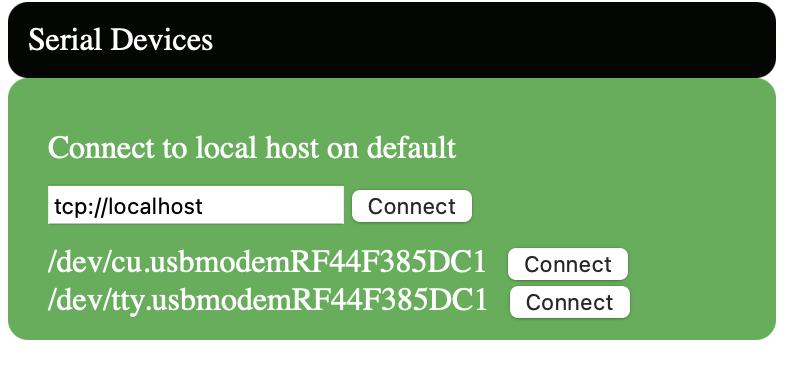

# Trendline
Graphical interface tool for Twinleaf sensor stream data. Equipped with RPC controls, real and complex fast fourier transform analysis

#### Installation
---
[Installing Rust and Cargo](https://doc.rust-lang.org/cargo/getting-started/installation.html)

Confirm all twinleaf-rust crate dependencies are satisfied.
Note that tauri has dependencies on Windows: Microsoft Visual Studio C++ build tools and Webview2

#### Running Program
---
With the src-tauri folder run the following command. Optionally specify the calculated time duration on FFT window or default to 10 seconds

        cargo run [time]

Connect the sensor to a proxy via the serial device window. 
If the proxy is already connected use the default:
        
        tcp://localhost

Otherwise identify the port from the list of serials or specify the url path

