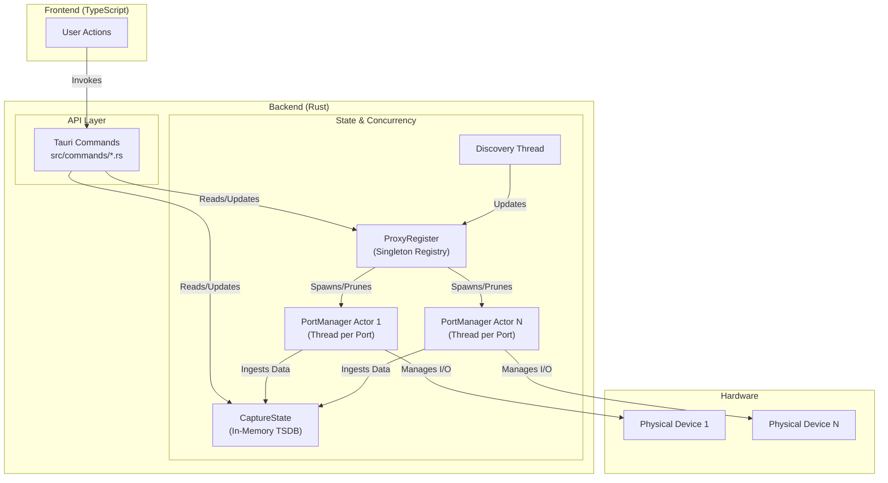

## Backend Architecture (Tauri/Rust)
The backend is an event-driven system built acting as the single source of truth for device state. It is a multi-threaded, actor-like model and handles it's connection to Twinleaf devices using the `twinleaf` crate. It also exposes its capabilities to the frontend exclusively through a set of asynchronous [Tauri commands](https://tauri.app/develop/calling-rust/) located in `commands` module. 

The architecture is centered on three core components: the **`ProxyRegister`**, the **`CaptureState`**, and the **`PortManager`**, which are distributed across the `state` and `proxy` modules respectively.

### 1. Data Aggregation & Querying (state module)
This module contains a registry of all the devices connected (`ProxyRegister`) and all the data streams that were stored (`CaptureState`).

`ProxyRegister` (`state/proxy_register.rs`)

- **Principle**: The main registry (`Arc<ProxyRegister>`) which acts as a factory and supervisor for `PortManager` actors

- **Responsibilities**:
    - Maintains a thread-safe map (`DashMap`) of active`PortManagers`, keyed by their port URL (e.g., `serial:///dev/tty.usbmodem1234`).
    - Instantiates new `PortManager` actors when a new device is discovered (`ensure()`).
    - Initiates the graceful shutdown of `PortManager` actors when a device is disconnected (`prune()`).

`CaptureState` (`state/capture.rs`)

- **Principle**: A singleton (Arc<Inner>) data store that holds all time-series data for the application session. It is completely decoupled from the hardware I/O, only receiving structured Point data.

- **Responsibilities**:
    - Stores data in a collection of thread-safe, capacity-limited buffers (`DashMap<DataColumnId, Buffer>`). Each buffer is a `BTreeMap` for efficient, sorted time-based queries.
    - Provides a high-level API for data insertion (`insert()`) used by `PortManagers`.
    - Provides a high-level API for complex data retrieval used by Tauri commands, including:
        - Fetching data within a specific time range (`get_data_in_range()`).
        - Performing on-the-fly decimation ([`fpcs`](https://ieeexplore.ieee.org/document/10669793/media#media), `min_max_bucket`) to prepare data for visualization.
        - Aligning and interpolating data from multiple, asynchronous streams into a unified PlotData structure.

### 2. Connection & Device Management (`proxy` module)
This system is responsible for the actual lifecycle of a hardware connection, from physical discovery to data streaming and configuration. It is implemented using an actor model, where each connected hardware port is managed by its own dedicated thread.

`PortManager` (`proxy/port_manager.rs`)

- **Principle**: An actor that encapsulates the state and logic for a single hardware port (e.g., a USB serial device, ethernet device over TCP). Each `PortManager` runs in its own dedicated thread, isolating I/O operations and state management from the main Tauri application

- **State Machine**: A finite state machine, transitioning through states defined in the shared::PortState enum:
    - `Idle` -> `Connecting` -> `Discovery` -> `Streaming`
    - Handles transient states like `Reconnecting` and terminal states like `Error` and `Disconnected`.

- **Responsibilities**:
    - Managing the low-level `twinleaf::tio::proxy` connection.
    - Running the device discovery handshake to identify all sub-devices on the port.
    - Continuously polling the device for new data samples in a tight loop (`poll_device_data()`).
    - Pushing validated time-series data into the central CaptureState.
    - Receiving commands from the API layer (e.g., to execute an RPC) and dispatching them to the hardware.
    - Updating its state and emitting events to the frontend (e.g., `port-state-changed()`).

`Discovery` (`proxy/discovery.rs`)

- **Principle**: A simple, long-running background thread that periodically scans the host system for compatible serial devices.

- **Responsibilities**:
    - Calls `util::get_valid_twinleaf_serial_urls` to get a list of currently connected devices.
    - Instructs the ProxyRegister to ensure managers for new devices and prune managers for disconnected ones.

### 3. Frontend API (commands module)

This is the public-facing interface of the backend.

- **Principle**: A set of stateless functions that orchestrate operations on the core state components (`ProxyRegister` and `CaptureState`). They are the bridge between frontend actions and backend logic.

- **Responsibilities**:
    - **Read Queries**: Commands like `get_latest_plot_data()` and `get_all_devices()` directly query `CaptureState` or `ProxyRegister` to retrieve data for the UI. They are a mix of state hydration and lifecycle queries.
    - **Write/Control**: Commands like `execute_rpc()` or `connect_to_port()` look up the appropriate `PortManager` in the `ProxyRegister` and delegate the operation to it.